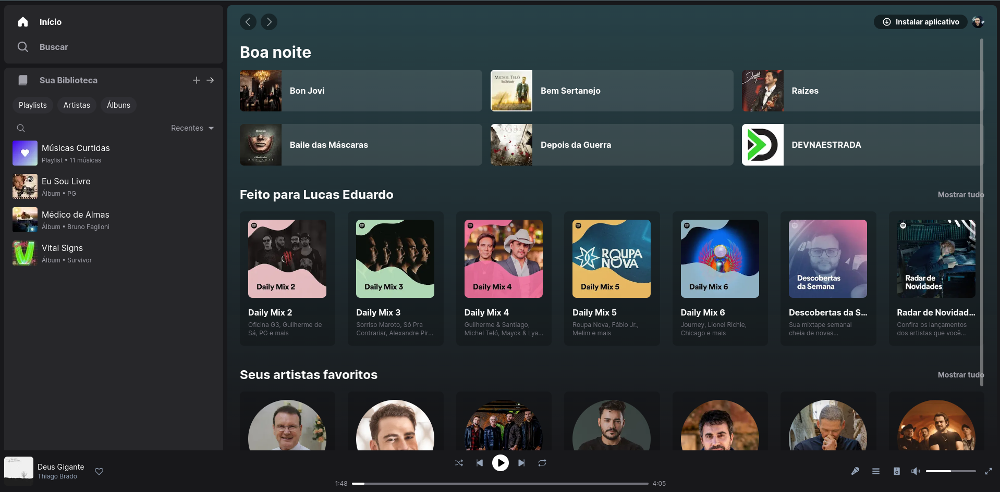

# UI Spotify Clone

<p align="center">
  

  

  <a href="https://www.linkedin.com/in/lucasdeveloperti/">
    
  </a>

  <a href="https://github.com/lucas-eduardo/ui-clone-spotify/commits/master">
    
  </a>

  

   <a href="https://github.com/lucas-eduardo/ui-clone-spotify/stargazers">
    
  </a>
</p>

## 💻 Sobre o clone

O clone da aplicação do spotify foi desenvolvimento apenas para fins de estudos e de desafio próprio. Não foi pensado na parte responsiva.

Link: https://ui-clone-spotify-gamma.vercel.app

---

## 🎨 Clone final

<div align="center">
  
</div>

---

## 🛠 Tecnologia

Foi utilizado o NextJS com TailwindCSS.

### 🧭 Rodando a aplicação

```bash
# Clone este repositório
$ git clone https://github.com/lucas-eduardo/ui-clone-spotify

# Acesse a pasta do projeto no seu terminal/cmd
$ cd ui-clone-spotify

# Instale as dependências
$ npm install

# Execute a aplicação em modo de desenvolvimento
$ npm start

# A aplicação será aberta na porta:3000 - acesse http://localhost:3000
```